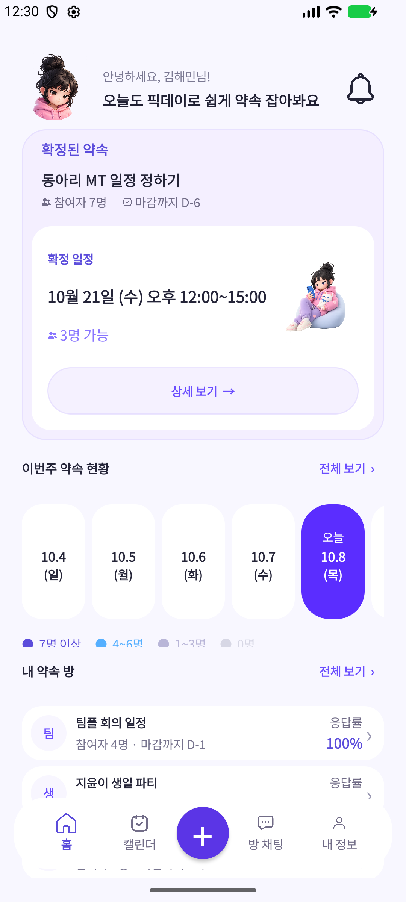
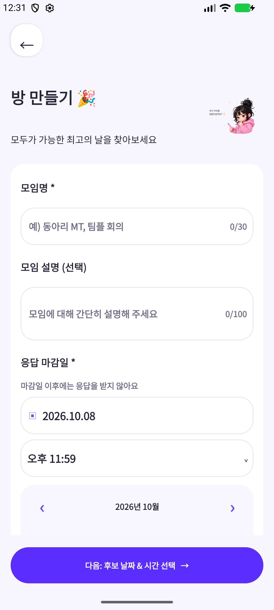
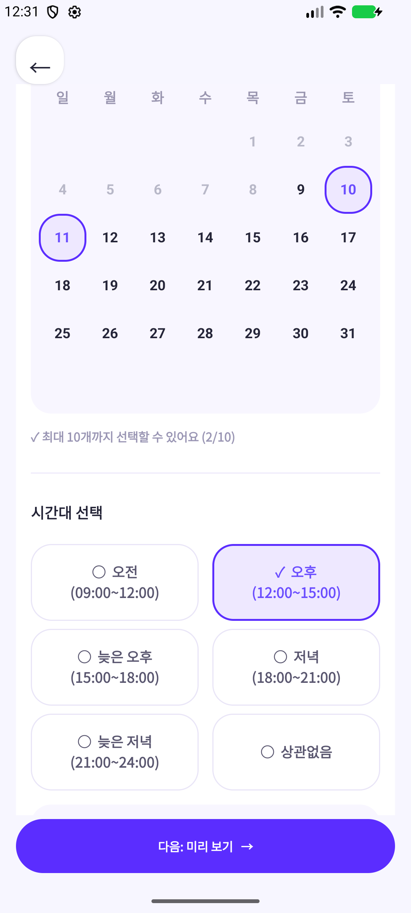
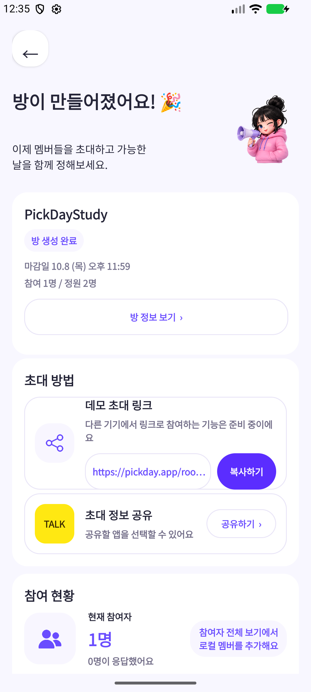
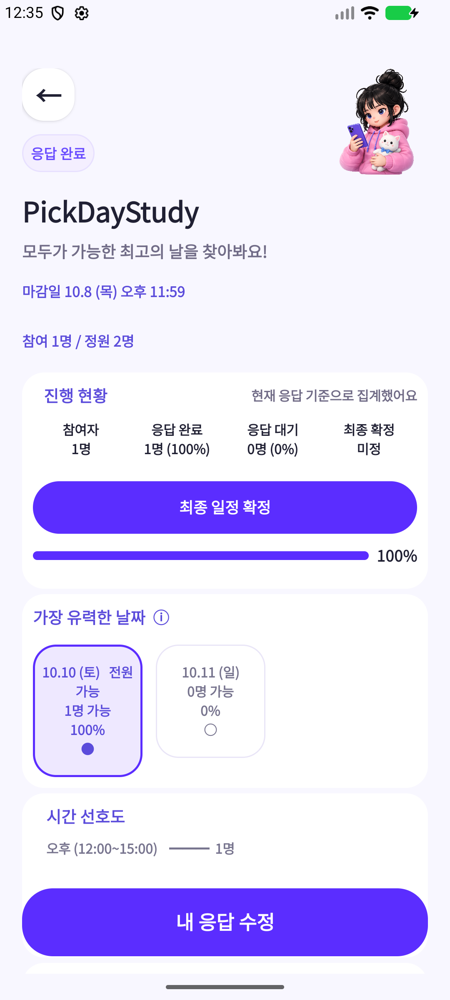
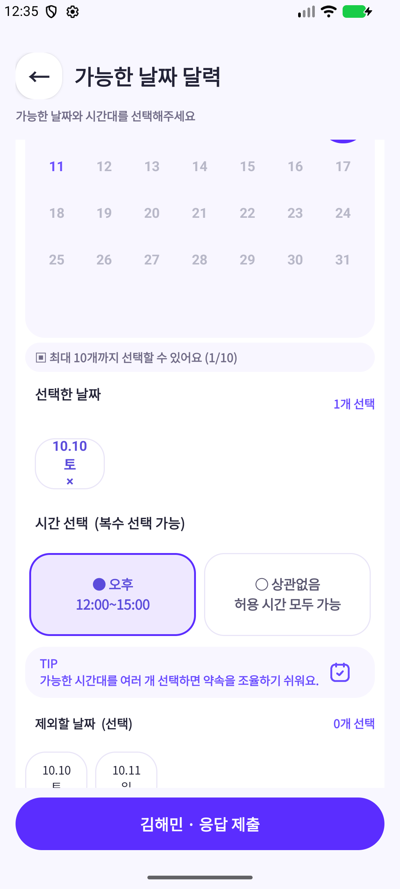
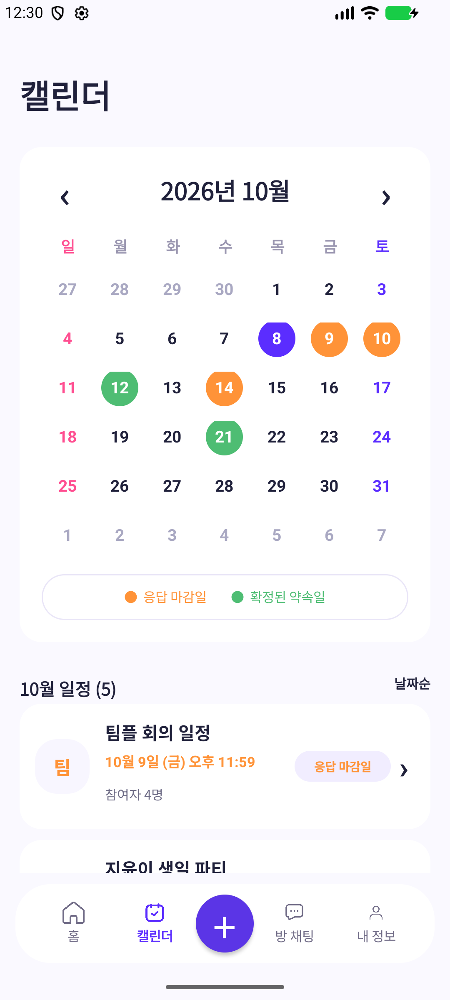
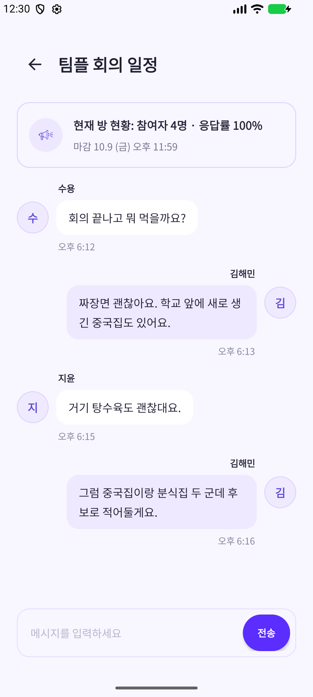
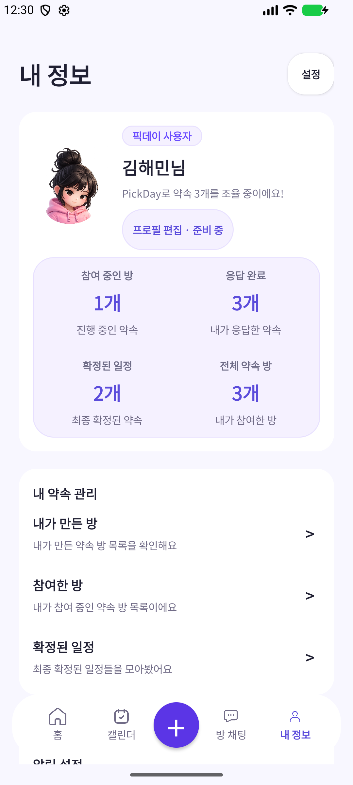

# PickDay

여러 사람이 가능한 날짜와 시간을 모아 약속 일정을 정하는 Android 앱입니다. 방 생성부터 참여자 응답, 일정 추천과 확정까지 한 기기에서 실행할 수 있습니다.

## 디자인과 실행 화면

[Figma 디자인 보기](https://www.figma.com/design/kdHvPDj4Ac85weMBIb6tyF/%ED%94%BD-%EB%8D%B0%EC%9D%B4--PickDay-?node-id=3-467&t=yp0hg0gAGQNN4oUJ-1)

Android 17(API 37) 에뮬레이터의 1080×2400 화면과 기본 글꼴에서 캡처했습니다. 샘플 데이터와 직접 입력한 로컬 데이터를 사용하며, 방 생성·응답 제출·일정 확정·채팅은 앱 실행 중 메모리에서 동작합니다.

<table>
  <tr>
    <th>홈</th>
    <th>방 생성</th>
    <th>후보 날짜·시간</th>
  </tr>
  <tr>
    <td></td>
    <td></td>
    <td></td>
  </tr>
  <tr>
    <th>초대</th>
    <th>방 상세</th>
    <th>참여자 응답</th>
  </tr>
  <tr>
    <td></td>
    <td></td>
    <td></td>
  </tr>
  <tr>
    <th>캘린더</th>
    <th>방 채팅</th>
    <th>내 정보</th>
  </tr>
  <tr>
    <td></td>
    <td></td>
    <td></td>
  </tr>
</table>

## 주요 기능

- 약속 방 생성과 작성 중 정보 수정: 제목, 설명, 응답 마감, 정원 설정
- 방장 후보 설정: 날짜 1~10개, 허용 시간대, 제외 날짜 선택
- 참여자 관리: 정원 내 로컬 참여자 추가, 참여자별 응답 입력과 수정
- 일정 추천: 같은 날짜·시간에 가능한 인원, 날짜 가능 인원, 이른 날짜·시간 순으로 정렬
- 일정 확정: 방장이 후보를 선택하면 홈, 상세, 캘린더에 반영
- 방별 메모리 채팅과 참여·응답·확정 이벤트 알림

새 방은 방장 1명으로 시작합니다. 방 상세의 참여자 전체 보기에서 이름을 추가하고, 각 참여자를 눌러 응답을 입력합니다. `상관없음`은 방장이 허용한 모든 시간대에 가능하다는 의미입니다. 모든 날짜가 불가능한 참여자는 후보를 모두 제외해 제출할 수 있습니다.

## 실행 환경

| 항목 | 설정 |
| --- | --- |
| 화면 구현 | Java, XML, AndroidX Activity, AppCompat, Material Components |
| 최소 Android 버전 | Android 8.0 / API 26 |
| 대상 SDK | API 36 |
| 컴파일 SDK | API 36.1 |
| Android Gradle Plugin | 9.2.1 |
| Gradle Wrapper | 9.4.1 |
| Gradle 실행 JDK | 21 (`gradle/gradle-daemon-jvm.properties`) |
| Java 소스 호환성 | 11 |
| 테스트 | JUnit 4, AndroidX Test, Espresso |

Android Studio에서 프로젝트를 열고 SDK와 Gradle 의존성을 설치한 뒤 `app`을 실행합니다. 기기나 에뮬레이터는 API 26 이상을 사용합니다.

```sh
./gradlew :app:assembleDebug :app:testDebugUnitTest :app:lintDebug
# 연결된 에뮬레이터 또는 테스트 기기에서 실행
./gradlew :app:connectedDebugAndroidTest
```

디버그 APK는 `app/build/outputs/apk/debug/app-debug.apk`에 생성됩니다.

## 데이터와 지원 범위

`LocalMeetupRepository`가 조회·입력 검증·상태 변경을 담당하고, `MeetupMemoryStore`가 실행 중 데이터를 보관합니다. 기본 샘플 방 3개와 응답·메시지는 `SampleMeetupData`에서 생성합니다. 모델 13개는 `model` 패키지에 정의합니다. `ScheduleCalculator`가 응답 집계와 추천 순위를 계산합니다. 화면 이동에는 `roomId`를 사용하며, 제목이 같은 방도 별개로 관리합니다.

데이터는 앱 프로세스가 살아 있는 동안 유지됩니다. 화면 재진입과 작성 중 회전을 처리하지만, 프로세스 종료 후에는 샘플 초기 상태로 시작합니다. 데이터베이스와 파일 저장은 사용하지 않습니다.

로그인 화면은 게스트 데모 진입을 제공합니다. 회원가입은 화면 미리보기이며 계정을 만들지 않습니다. 초대 문구 복사와 Android 공유 시트는 사용할 수 있지만 다른 기기에서 링크로 참여하는 기능은 없습니다. 네트워크 채팅, 푸시, 장소 추천, 알림 읽음 처리와 사용자 설정 저장도 지원하지 않습니다.

시스템 설정과 관계없이 밝은 테마를 제공합니다. 공통 화면 기반에서 시스템 바와 키보드 여백을 처리합니다. 내 정보의 진행·응답·확정·전체 방 수는 현재 사용자 데이터로 집계합니다.

Activity와 레이아웃의 표시 문구는 `strings.xml`에서 관리합니다. 인원, 응답률, 마감과 확인 문구는 서식 문자열을 사용합니다.

## 개발 규칙

- 기능 브랜치는 `dev`에서 분기하고 PR로 병합합니다. `main`은 검토와 검증을 마친 배포 기준 브랜치입니다.
- 브랜치 접두사는 `feat`, `fix`, `refactor`, `docs`, `style`, `test`, `chore`를 사용합니다.
- 커밋 메시지는 `type: 한국어 요약` 형식으로 작성합니다.
- 코드 주석은 한국어로 작성하고, 처리 이유와 예외 규칙을 설명합니다. 식별자는 Android/Java 관례를 따릅니다.
- 기능, 화면 흐름, 모델 변경에는 관련 문서와 검증 결과를 함께 반영합니다.

## 문서

- [현재 구현](docs/CURRENT_IMPLEMENTATION.md)
- [개발 방향](docs/project-direction.md)
- [로드맵](docs/roadmap.md)
- [개발 워크플로우](docs/development-workflow.md)
- [UI 가이드라인](docs/ui-guidelines.md)
- [디자인 구현 계획](docs/design-implementation-plan.md)
- [화면 흐름](docs/screen-flow.md)
- [데이터 모델](docs/data-model.md)
- [코드 구조와 문자열 관리](docs/code-structure.md)
- [API 계약 초안](docs/api-contract-draft.md)
- [수동 테스트 케이스](docs/manual-test-cases.md)
- [UI·사용성 점검 결과](docs/ui-review.md)
- [과제 보고서 준비 문서](docs/assignment-report-prep.md)
