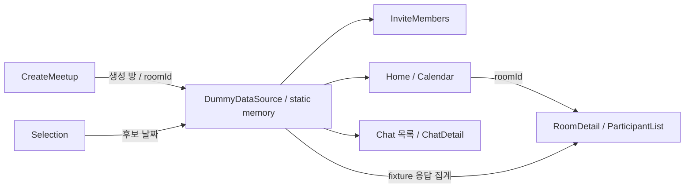

# dev 구현 상태

`DummyDataSource`의 static collection은 생성 방과 후보 날짜를 프로세스 메모리에 보관한다. 기본 방 fixture와 생성 방을 `roomId`로 연결한다. Activity들이 EXTRA_ROOM_ID를 넘기고 title 기반 함수는 일부 호환용으로 남아 있다.

RoomDetail 통계는 `AvailabilityResponse` fixture 집계다. Participant ResponseSelection의 선택을 실제 응답 저장소로 제출하는 흐름은 없고 완료 후 방 상세로 돌아간다. ChatDetail은 방별 fixture를 보여주며 네트워크 송수신은 없다. 알림도 fixture이며 push 서비스가 아니다.

## 설계 문서와 코드의 관계

`api-contract-draft.md`의 OAuth/JWT/rooms API, `data-model.md`의 Repository interface·Retrofit·저장 모델은 목표 또는 계약 초안이다. 현재 Java 구현은 `data/DummyDataSource.java`와 각 Activity를 기준으로 읽는다. 계획 문서의 통계·달력 완료 기준도 구현 보증이 아니다.

| 항목 | 현재 경계 |
|---|---|
| 로그인 | 로컬 화면 흐름, 서버 인증 없음 |
| 데이터 | 더미 객체 및 UI 상태, 영구 DB 없음 |
| 초대 | 복사·공유 화면, 서버 참여 처리 없음 |
| 응답 | 선택 UI와 화면 이동, 백엔드 제출 없음 |
| 통신 | REST/WebSocket client와 server 없음 |

## 확인할 파일

[DummyDataSource](../app/src/main/java/com/hazyala/pickday/kopo/ac/kr/data/DummyDataSource.java) · [Manifest](../app/src/main/AndroidManifest.xml) · [Gradle 설정](../app/build.gradle.kts)
