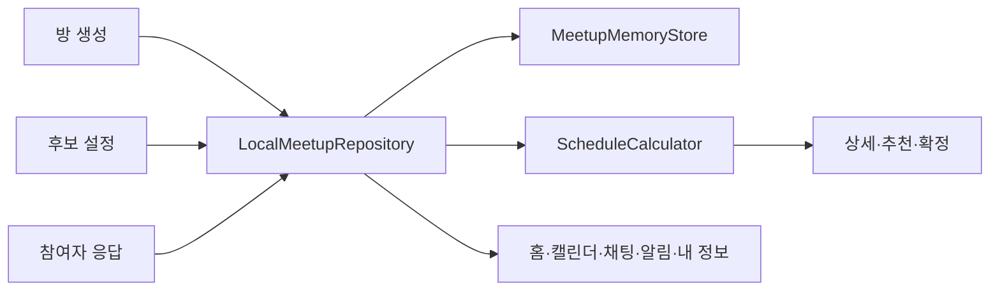

# 현재 구현

Java Activity와 XML로 약속 조율 화면을 구현합니다. `LocalMeetupRepository`가 검증·조회·상태 변경을 담당하고 `MeetupMemoryStore`가 실행 중 데이터를 보관합니다. 기본 샘플은 `SampleMeetupData`, 독립 모델은 `model` 패키지에 있습니다.

## 핵심 흐름

방 생성 → 후보 날짜·허용 시간 설정 → 참여자 추가 → 참여자별 응답 제출·수정 → 추천 후보 계산 → 방장 일정 확정을 한 기기에서 진행합니다. Activity 간에는 `roomId`와 참여자 이름을 Intent로 전달합니다.

`ScheduleCalculator`는 같은 날짜·시간에 가능한 인원, 날짜 가능 인원, 이른 날짜·시간 순으로 추천합니다. 응답 마감·정원·중복 이름·확정 후 수정 제한을 검증합니다. 확정 일정은 홈·상세·월간 캘린더에 표시합니다.

## 지원 범위

| 항목 | 현재 동작과 제한 |
| --- | --- |
| 로그인 | 게스트 데모 진입, 계정 생성·서버 인증 없음 |
| 방·응답 | 생성·수정·참여자 추가·응답 제출·집계·일정 확정 |
| 데이터 | 프로세스 메모리 보관, 프로세스 종료 후 샘플로 초기화 |
| 초대 | 클립보드 복사·Android 공유, 다른 기기의 링크 참여 없음 |
| 채팅 | 방별 메모리 메시지 전송, 네트워크 송수신 없음 |
| 알림 | 로컬 참여·응답·확정 이벤트와 샘플 요약, 푸시 없음 |
| 내 정보 | 실제 사용자 기준 방 통계, 프로필·설정 메뉴는 준비 중 |
| 화면 | 밝은 테마, 시스템 바·키보드 여백, 공통 달력과 문자열 리소스 |

서버 API와 인증·동기화는 [API 계약 초안](api-contract-draft.md)의 계획입니다. 데이터베이스·파일 저장·Repository 인터페이스는 구현하지 않았습니다.

## 검증과 코드

단위 테스트 25개와 기기 테스트 10개를 통과했습니다. 빌드·lint 결과, 화면 크기·글꼴 조건과 남은 점검 범위는 [UI 점검 결과](ui-review.md)에 기록합니다.

[코드 구조](code-structure.md) · [데이터 모델](data-model.md) · [화면 흐름](screen-flow.md) · [수동 테스트](manual-test-cases.md) · [저장소 코드](../app/src/main/java/com/hazyala/pickday/kopo/ac/kr/data/LocalMeetupRepository.java)
